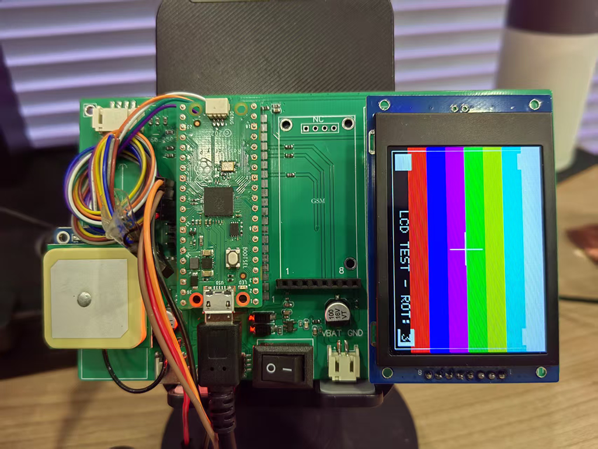

# ST7789 Pico 显示驱动库

[](LICENSE)
[](https://www.raspberrypi.com/products/raspberry-pi-pico/)
[](https://github.com/musicaJack/ST7789_Pico/releases)

[English](README.md) | 中文

这是一个用于树莓派 Pico 的高性能 ST7789 TFT 显示屏驱动库。该库提供了完整的显示控制功能，包括图形渲染、文本显示和基础显示操作。

## 特性

- 完整的 ST7789 显示屏驱动支持
- 硬件抽象层设计，便于移植
- 内置图形绘制功能
- 优化的 SPI 通信
- 简单易用的 API 接口
- DMA 支持（Beta 阶段，可能存在不稳定性）

## 项目架构

项目采用模块化设计，主要包含以下组件：

### 核心模块

- `st7789.hpp/cpp`: 核心驱动实现，包含显示屏初始化和基础控制功能
- `st7789_hal.hpp/cpp`: 硬件抽象层，处理底层硬件通信
- `st7789_gfx.hpp/cpp`: 图形功能实现，提供绘图和显示功能
- `st7789_font.cpp`: 字体支持
- `st7789_config.hpp`: 配置文件，包含引脚定义和显示参数

### 目录结构

```
├── src/                    # 源代码目录
│   ├── st7789.cpp         # 核心驱动实现
│   ├── st7789_hal.cpp     # 硬件抽象层
│   ├── st7789_gfx.cpp     # 图形功能
│   └── st7789_font.cpp    # 字体支持
├── include/               # 头文件目录
│   ├── st7789.hpp        # 核心驱动头文件
│   ├── st7789_hal.hpp    # 硬件抽象层头文件
│   ├── st7789_gfx.hpp    # 图形功能头文件
│   └── st7789_config.hpp # 配置文件
├── demo/                  # 示例代码
├── build/                 # 构建输出目录
└── CMakeLists.txt        # CMake 构建配置
```

## 快速开始

### 硬件连接

1. 将 ST7789 显示屏连接到树莓派 Pico：
   - SCK: GPIO18
   - MOSI: GPIO19
   - CS: GPIO17
   - DC: GPIO20
   - RST: GPIO15
   - BLK: GPIO10
   - VCC: 3.3V
   - GND: GND

接线图：
```
树莓派 Pico                ST7789 显示屏
+---------------+         +---------------+
|               |         |               |
|  GPIO18 (SCK) |-------->| SCK          |
|  GPIO19 (MOSI)|-------->| MOSI         |
|  GPIO17 (CS)  |-------->| CS           |
|  GPIO20 (DC)  |-------->| DC           |
|  GPIO15 (RST) |-------->| RST          |
|  GPIO10 (BLK) |-------->| BLK          |
|  3.3V         |-------->| VCC          |
|  GND          |-------->| GND          |
|               |         |               |
+---------------+         +---------------+
```

注意事项：
1. 确保所有连接牢固，避免虚接
2. 电源连接前请仔细检查，避免接反
3. 如果显示屏不工作，请检查：
   - 电源电压是否稳定在 3.3V
   - 所有信号线连接是否正确
   - 背光控制线是否正确连接

### 软件配置

1. 克隆仓库：
```bash
git clone https://github.com/musicaJack/ST7789_Pico.git
cd ST7789_Pico
```

2. 构建项目：
```bash
./build_pico.bat
```

3. 上传到 Pico：
```bash
./deploy_to_pico.bat
```

## API 使用指南

### 基础配置

```cpp
#include "st7789.hpp"

// 创建显示对象
st7789::ST7789 display;

// 配置显示参数
st7789::Config config;
config.spi_inst = spi0;           // 使用 SPI0
config.spi_speed_hz = 40000000;   // 40MHz SPI 速度
config.pin_din = 19;              // MOSI
config.pin_sck = 18;              // SCK
config.pin_cs = 17;               // CS
config.pin_dc = 20;               // DC
config.pin_reset = 15;            // RST
config.pin_bl = 10;               // 背光
config.width = 240;               // 显示宽度
config.height = 320;              // 显示高度
config.rotation = st7789::ROTATION_0;  // 显示方向

// 初始化显示屏
if (!display.begin(config)) {
    // 处理初始化失败
    return -1;
}
```

### 基础显示操作

```cpp
// 清屏
display.clear();

// 设置显示方向
display.setRotation(st7789::ROTATION_90);  // 可选：ROTATION_0, ROTATION_90, ROTATION_180, ROTATION_270

// 设置背光亮度（0-255）
display.setBrightness(128);
```

### 图形绘制

```cpp
// 绘制像素点
display.drawPixel(10, 10, st7789::RED);

// 绘制直线
display.drawLine(0, 0, 100, 100, st7789::GREEN);

// 绘制矩形
display.drawRect(50, 50, 100, 100, st7789::BLUE);

// 填充矩形
display.fillRect(50, 50, 100, 100, st7789::YELLOW);

// 绘制圆形
display.drawCircle(120, 160, 50, st7789::CYAN);

// 填充圆形
display.fillCircle(120, 160, 50, st7789::MAGENTA);
```

### 文本显示

```cpp
// 显示文本（默认白色，黑色背景）
display.drawString(10, 10, "Hello World!");

// 显示彩色文本
display.drawString(10, 30, "Colored Text", st7789::RED);

// 显示带背景色的文本
display.drawString(10, 50, "Text with Background", st7789::WHITE, st7789::BLUE);
```

### DMA 功能（Beta）

```cpp
// 启用 DMA（默认已启用）
config.dma.enabled = true;
config.dma.buffer_size = 4096;  // 4KB DMA 缓冲区

// 使用 DMA 填充矩形
display.fillRectDMA(0, 0, 240, 320, st7789::BLACK);

// 检查 DMA 状态
if (display.isDmaEnabled()) {
    // DMA 已启用
}

if (display.isDmaBusy()) {
    // DMA 传输正在进行中
}
```

注意事项：
1. DMA 功能目前处于 Beta 阶段，可能存在不稳定性
2. 建议在非关键应用场景下使用 DMA 功能
3. 如果遇到显示异常，可以尝试禁用 DMA：
   ```cpp
   config.dma.enabled = false;
   ```

## 颜色定义

库中预定义了以下颜色（RGB565格式）：
- `st7789::BLACK` (0x0000)
- `st7789::WHITE` (0xFFFF)
- `st7789::RED` (0xF800)
- `st7789::GREEN` (0x07E0)
- `st7789::BLUE` (0x001F)
- `st7789::YELLOW` (0xFFE0)
- `st7789::CYAN` (0x07FF)
- `st7789::MAGENTA` (0xF81F)

也可以使用自定义颜色：
```cpp
uint16_t customColor = 0x1234;  // 自定义 RGB565 颜色
```

## 贡献指南

欢迎提交 Pull Request 或创建 Issue。在提交代码前，请确保：

1. 代码符合项目的编码规范
2. 添加了必要的注释和文档
3. 所有测试都能通过

## 许可证

本项目采用 MIT 许可证。详见 [LICENSE](LICENSE) 文件。

## 联系方式

如有问题或建议，请通过以下方式联系：

- 邮件联系
- 发送邮件至：yinyue@beingdigital.cn

## 致谢

感谢所有为本项目做出贡献的开发者。 